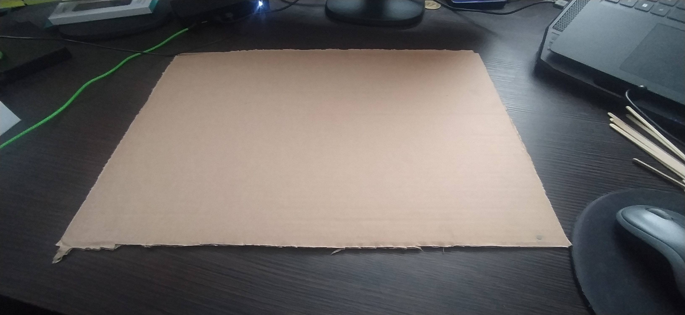
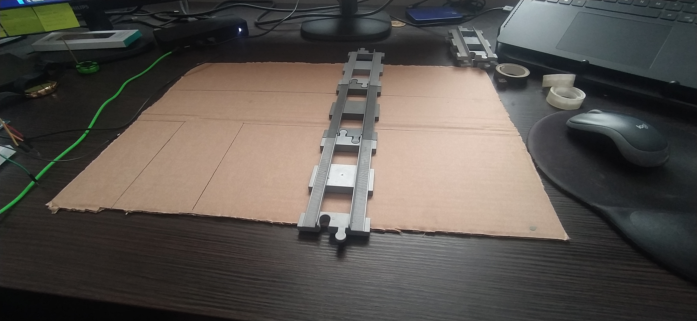

# Dokumentacja budowy makiety

## Cel makiety

Makieta została wykonana w celu przedstawienia działania inteligentnego skrzyżowania drogowego z przejazdem kolejowym.

Do budowy wykorzystano karton jako podstawę konstrukcji, patyczki po lodach do wykonania rogatek, elementy LEGO do budowy torów kolejowych oraz modele pojazdów.

Makieta została zaprojektowana tak, aby umożliwić prezentację działania sygnalizacji świetlnej, przejazdu kolejowego oraz automatycznego sterowania rogatkami.

## Krok 1 – przygotowanie podstawy

Pierwszym etapem budowy było przygotowanie podstawy makiety.

Jako podstawę wykorzystano karton, na którym zostanie umieszczona droga, przejazd kolejowy oraz wszystkie elementy elektroniczne projektu.

Na tym etapie wyznaczono również orientacyjne położenie torów kolejowych oraz skrzyżowania.

## Krok 2 – wykonanie drogi i torów kolejowych

Po przygotowaniu podstawy makiety wyznaczono przebieg drogi oraz przejazdu kolejowego.

Droga została narysowana bezpośrednio na kartonie. Następnie w wyznaczonym miejscu zamontowano tory kolejowe wykonane z klocków LEGO.

Na tym etapie określono ostateczne położenie skrzyżowania oraz przejazdu kolejowego, co ułatwiło rozmieszczenie pozostałych elementów makiety.

