# Dokumentacja budowy makiety

## Cel makiety

Makieta została wykonana w celu przedstawienia działania inteligentnego skrzyżowania drogowego z przejazdem kolejowym.

Do budowy wykorzystano karton jako podstawę konstrukcji, patyczki po lodach do wykonania rogatek, elementy LEGO do budowy torów kolejowych oraz modele pojazdów.

Makieta została zaprojektowana tak, aby umożliwić prezentację działania sygnalizacji świetlnej, przejazdu kolejowego oraz automatycznego sterowania rogatkami.

## Krok 1 – przygotowanie podstawy

Pierwszym etapem budowy było przygotowanie podstawy makiety.

Jako podstawę wykorzystano karton, na którym zostanie umieszczona droga, przejazd kolejowy oraz wszystkie elementy elektroniczne projektu.

Na tym etapie wyznaczono również orientacyjne położenie torów kolejowych oraz skrzyżowania.

## Krok 2 – wykonanie drogi i torów kolejowych

Po przygotowaniu podstawy makiety wyznaczono przebieg drogi oraz przejazdu kolejowego.

Droga została narysowana bezpośrednio na kartonie. Następnie w wyznaczonym miejscu zamontowano tory kolejowe wykonane z klocków LEGO. Przymocowano je za pomocą plateliny.

Na tym etapie określono ostateczne położenie skrzyżowania oraz przejazdu kolejowego, co ułatwiło rozmieszczenie pozostałych elementów makiety.

## Krok 3 – budowa rogatek

Kolejnym etapem było wykonanie rogatek przejazdu kolejowego.

Do budowy ramion rogatek wykorzystano patyczki po lodach, które zostały przymocowane do serwomechanizmów za pomocą taśmy klejącej. Dzięki temu możliwe jest automatyczne podnoszenie i opuszczanie rogatek podczas działania systemu.

W celu stabilnego zamocowania serwomechanizmów wykonano konstrukcję z klocków LEGO. Pełni ona funkcję stojaka, który utrzymuje serwa we właściwej pozycji i zapobiega ich przemieszczaniu się podczas pracy.

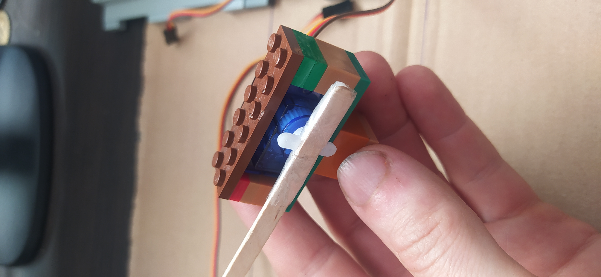

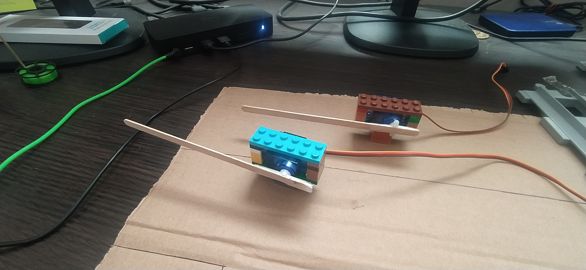

## Krok 4 – montaż sygnalizacji świetlnej

Kolejnym etapem było wykonanie sygnalizacji świetlnej skrzyżowania oraz świateł ostrzegawczych przejazdu kolejowego.

Do wykonania pojedynczego światła wykorzystano:

- 1 diodę LED,
- 1 rezystor,
- 2 przewody połączeniowe damsko-męskie.

Krótsza nóżka diody LED (katoda) została połączona z rezystorem. Następnie do wolnej końcówki rezystora podłączono przewód połączeniowy.

Drugi przewód został podłączony do dłuższej nóżki diody LED (anody).

W ten sposób przygotowano wszystkie światła wykorzystane w projekcie. Następnie zamontowano je na słupach wykonanych z patyczków po lodach.

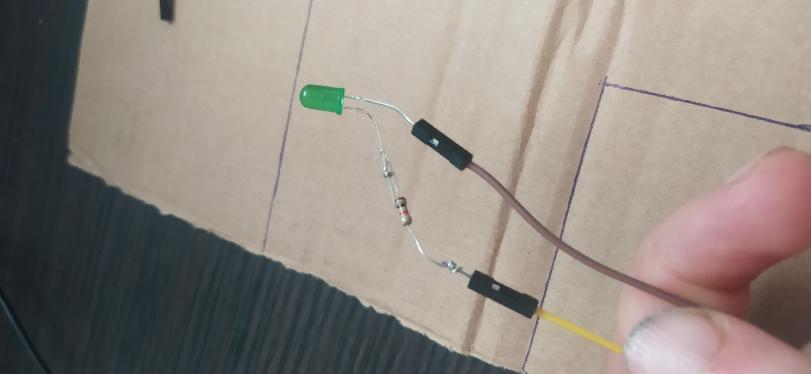

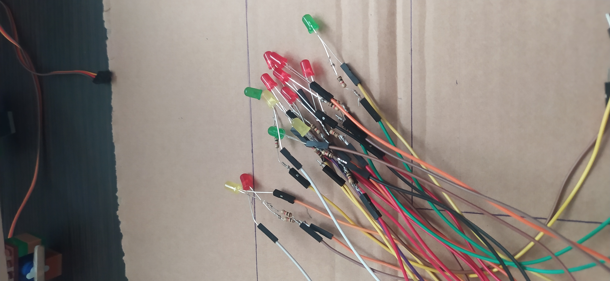

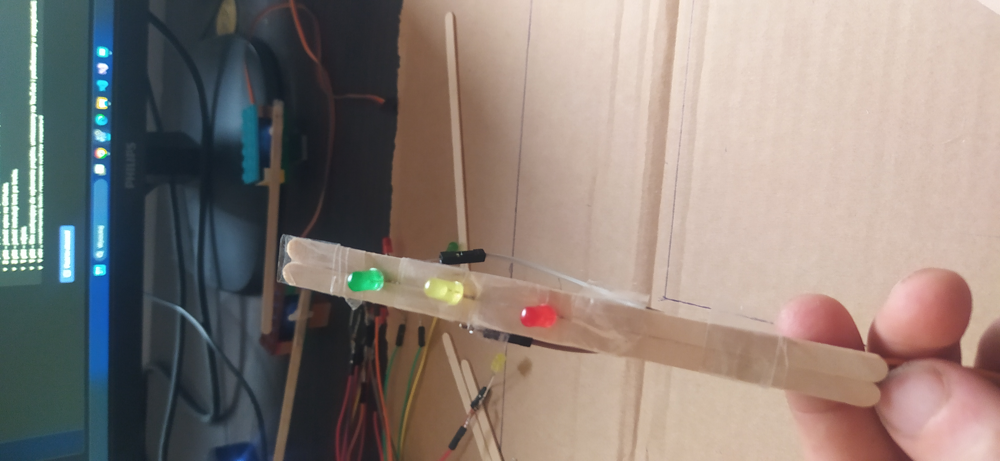

!!!UWAGA!!!

Podczas montażu należy zwrócić szczególną uwagę, aby przewody znajdujące się z tyłu sygnalizatora nie stykały się ze sobą. Kontakt przewodów może spowodować zwarcie, co może doprowadzić do nieprawidłowego działania układu lub uszkodzenia elementów elektronicznych.Można je zabezpieczyć czarną taśmą izolacyjną.

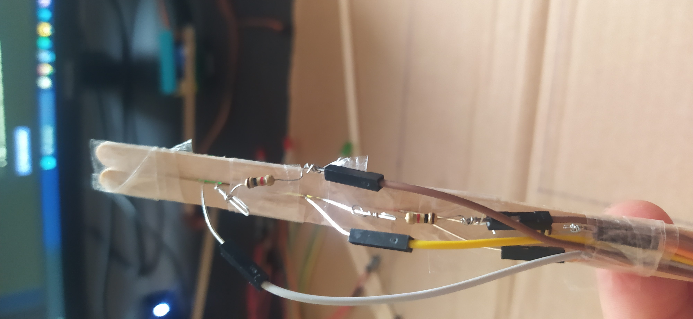

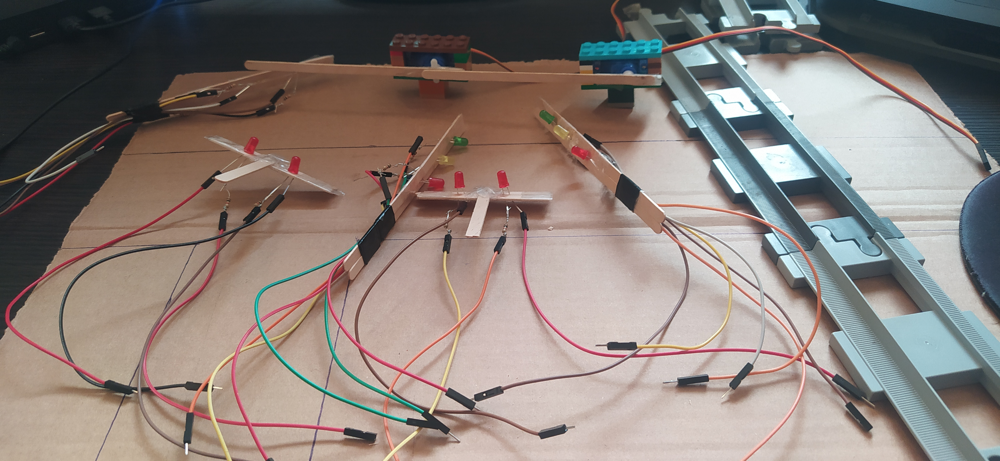

## Krok 5 – montaż płytki stykowej i mikrokontrolera ESP32

Kolejnym etapem było zamontowanie płytki stykowej oraz mikrokontrolera ESP32.

Ze względu na brak przylutowanych listew goldpin w wykorzystanym mikrokontrolerze ESP32 zastosowano fragment pianki, który pełnił funkcję podkładki stabilizującej. Rozwiązanie to umożliwiło bezpieczne umieszczenie mikrokontrolera na makiecie oraz podłączenie przewodów do odpowiednich pinów.

W przypadku mikrokontrolera wyposażonego w przylutowane listwy goldpin możliwe jest bezpośrednie umieszczenie go w płytce stykowej, bez konieczności stosowania dodatkowej podkładki.

Po zamontowaniu płytki stykowej oraz ESP32 przygotowano układ do wykonania wszystkich połączeń elektrycznych.

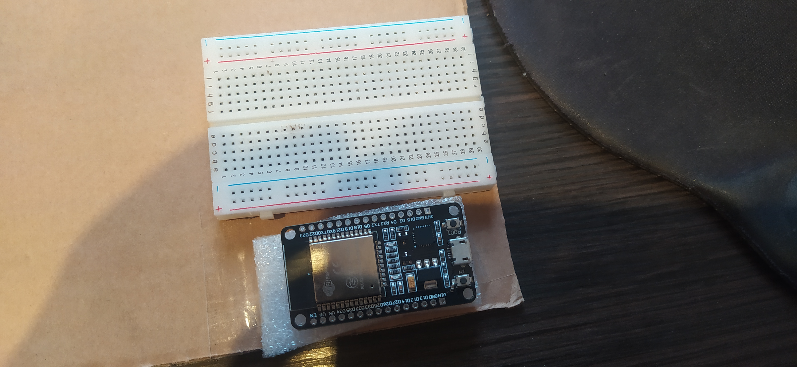

## Krok 6 – montaż czujników ultradźwiękowych

Następnym etapem było zamontowanie czujników ultradźwiękowych odpowiedzialnych za wykrywanie nadjeżdżającego oraz odjeżdżającego pociągu.

Do wykonania uchwytów wykorzystano klocki LEGO, które zapewniły stabilne mocowanie czujników. Dodatkowo zastosowano plastelinę, dzięki której możliwe było precyzyjne ustawienie czujników pod odpowiednim kątem.

Jeden czujnik umieszczono przed przejazdem kolejowym, natomiast drugi za przejazdem. Takie rozmieszczenie umożliwia wykrycie wjazdu pociągu na przejazd oraz opuszczenia przez niego strefy przejazdu.

Po zamontowaniu czujników sprawdzono poprawność ich działania oraz zakres wykrywania obiektów.

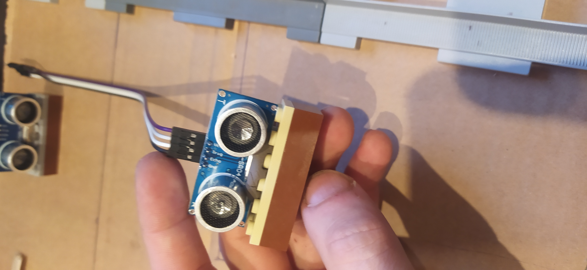

## Krok 7 – montaż końcowy makiety

Po przygotowaniu wszystkich elementów przystąpiono do montażu końcowego makiety.

Na tym etapie zamontowano sygnalizację świetlną, rogatki, czujniki ultradźwiękowe, płytkę stykową oraz mikrokontroler ESP32. Wszystkie elementy zostały rozmieszczone zgodnie z wcześniej przygotowanym projektem.

W miejscach, gdzie sygnalizacja świetlna lub czujniki znajdowały się w większej odległości od mikrokontrolera ESP32, zastosowano dodatkowe przewody połączeniowe umożliwiające prawidłowe podłączenie wszystkich elementów.

W celu zwiększenia stabilności konstrukcji wybrane elementy zostały dodatkowo przymocowane za pomocą taśmy, co zapobiega ich przesuwaniu się podczas użytkowania i prezentacji projektu.

Po zakończeniu montażu sprawdzono poprawność wszystkich połączeń elektrycznych oraz działanie poszczególnych elementów systemu.

Sygnalizacja świetlna oraz rogatki zostały zamocowane przy użyciu plasteliny. Rozwiązanie to umożliwiło szybkie ustawienie elementów we właściwej pozycji oraz ich stabilne przymocowanie do podłoża makiety. Dodatkowo plastelina pozwala na łatwą zmianę położenia elementów podczas dalszych prac nad projektem.

Przewody połączeniowe zostały poprowadzone pod drogą makiety, dzięki czemu są mniej widoczne i nie wpływają na wygląd całej konstrukcji. Takie rozwiązanie poprawia estetykę projektu oraz zmniejsza ryzyko przypadkowego zahaczenia o przewody podczas prezentacji.

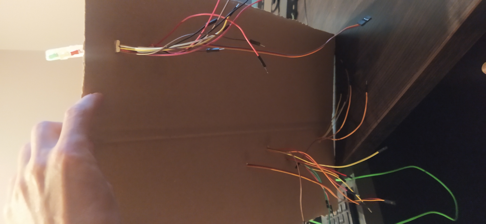

## Efekt końcowy

Po zakończeniu wszystkich prac powstała w pełni funkcjonalna makieta inteligentnego skrzyżowania z przejazdem kolejowym sterowanego za pomocą mikrokontrolera ESP32.

Makieta umożliwia prezentację działania sygnalizacji świetlnej, automatycznego sterowania rogatkami oraz wykrywania pociągu za pomocą czujników ultradźwiękowych.

Poniżej przedstawiono gotowy projekt.

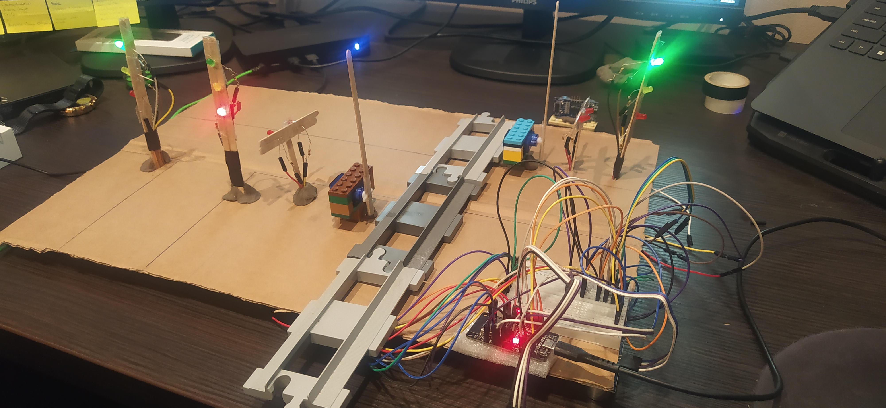

