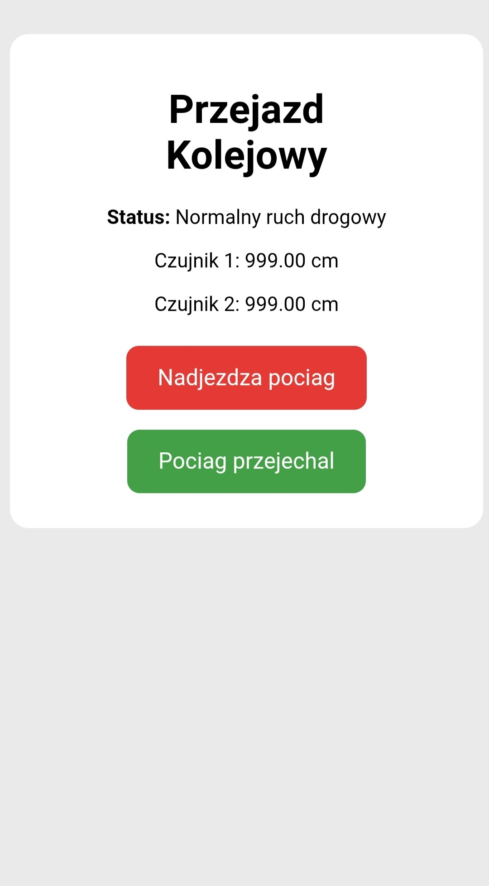

# Opis interfejsu WWW

## Cel interfejsu

Projekt został wyposażony w prosty interfejs WWW umożliwiający monitorowanie stanu przejazdu kolejowego oraz ręczne sterowanie wybranymi funkcjami systemu.

Strona internetowa jest hostowana bezpośrednio przez mikrokontroler ESP32 i może zostać otwarta na dowolnym urządzeniu znajdującym się w tej samej sieci WiFi.

## Działanie interfejsu

Po uruchomieniu projektu użytkownik może obserwować aktualny stan systemu. Na stronie wyświetlane są informacje o stanie przejazdu kolejowego oraz odczyty z obu czujników ultradźwiękowych.

Interfejs umożliwia również ręczne sterowanie przejazdem kolejowym za pomocą dwóch przycisków.

Przycisk „Nadjeżdża pociąg” uruchamia procedurę przejazdu kolejowego. System zatrzymuje ruch drogowy, uruchamia sygnalizację ostrzegawczą oraz opuszcza rogatki.

Przycisk „Pociąg przejechał” kończy procedurę przejazdu kolejowego. Rogatki zostają podniesione, światła ostrzegawcze wyłączone, a sygnalizacja drogowa wraca do normalnego trybu pracy.

## Dostęp do strony

Po połączeniu mikrokontrolera ESP32 z siecią WiFi w monitorze portu szeregowego wyświetlany jest adres IP urządzenia.

Po wpisaniu tego adresu do przeglądarki internetowej użytkownik uzyskuje dostęp do strony sterującej projektem.

## Widok interfejsu

Poniżej przedstawiono wygląd interfejsu WWW.

