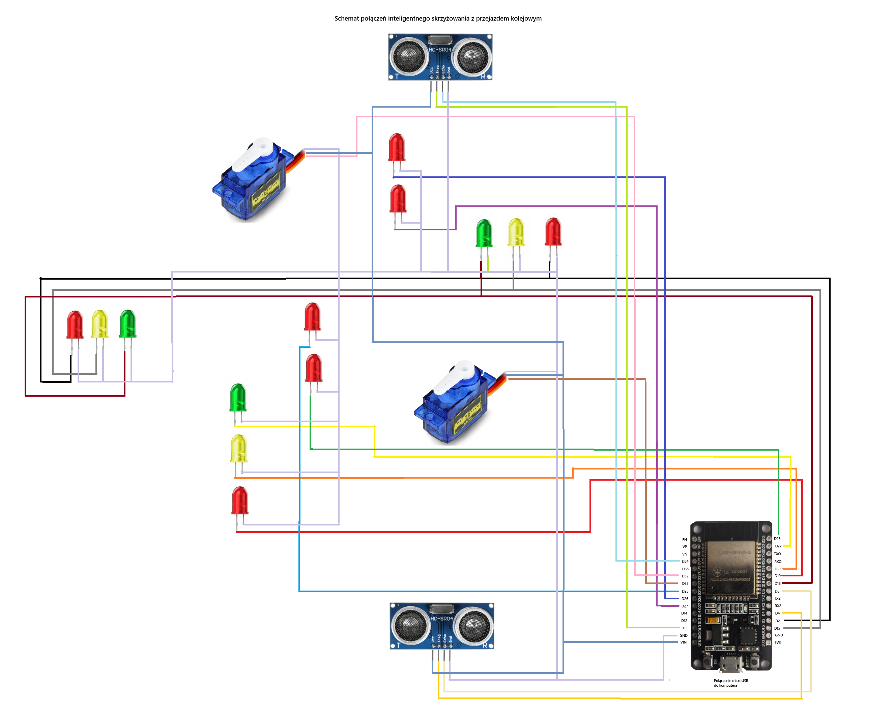

# Schemat połączeń

Schemat połączeń elektrycznych projektu został wykonany na płytce stykowej z wykorzystaniem mikrokontrolera ESP32.
Do sterowania sygnalizacją świetlną wykorzystano diody LED podłączone do odpowiednich pinów mikrokontrolera.
Przejazd kolejowy wyposażono w dwa serwomechanizmy sterujące rogatkami oraz dwa czujniki ultradźwiękowe odpowiedzialne za wykrywanie nadjeżdżającego i odjeżdżającego pociągu.
Poniżej przedstawiono schemat połączeń wszystkich elementów projektu.

